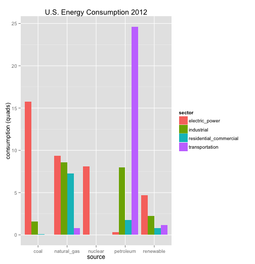

## Introduction


There are other options for open-source data analysis: Octave, Python, and Rapid Miner (GUI).

This presentation focuses on R and RStudio:

* R is an _outstanding_ tool for prototyping a data-analysis.

* Everything demonstrated here is available without license fees.

* There is an investment in yourself to learn. Learning, done properly, will be frustrating.

* Exchange of programs and snippets is simple exchange of text.

Warning:

* about 80% of data-analysis is simply wrestling with data

* does not lend itself to an introductory presentation

<i class="fa fa-link"></i> [Octave](http://www.gnu.org/software/octave/)
<i class="fa fa-link"></i> [Python](http://www.python.org/)
<i class="fa fa-link"></i> [Rapid Miner](http://rapidminer.com/) 


---
## Installation

You will need to install:

* Base R: [www.r-project.org](http://www.r-project.org/) 

  The `0-Cloud` archive works well. 

* RStudio IDE: [www.rstudio.com](http://www.rstudio.com)

In general, install the latest versions; the defaults work very well. 

Some helpful videos from Amanda Traud:

* <i class="fa fa-youtube"></i> [Installing R](http://youtu.be/X_oFb2iAdu8)
* <i class="fa fa-youtube"></i> [Installing RStudio](http://youtu.be/AZPbg29Plpw)

--- &my_twocol  w1:33% w2:65%
## Tour of RStudio IDE

*** =left

`Screencast` at
  
<i class="fa fa-play-circle-o"></i> [www.rstudio.com/ide](http://www.rstudio.com/ide/)

*** =right

 


--- &my_twocol  w1:33% w2:65%
## Vectors

*** =left

Collection of like objects

Assembled using `c()`

*** =right


```r
a <- c(1, 2, 3)
b <- c(4, 5, 6)
a
```

```
[1] 1 2 3
```

```r
b
```

```
[1] 4 5 6
```

```r
c(a, b)
```

```
[1] 1 2 3 4 5 6
```


*** =foot

<i class="fa fa-youtube"></i> GoogleDeveloplers:
[Create and Work With Vectors](http://youtu.be/YhQOV27pQfg)

--- &my_twocol  w1:33% w2:65%
## Vectors

*** =left

Can be:

* numeric
* character
* logical

*** =right


```r
c(1,2)
```

```
[1] 1 2
```

```r
c("Square D", "Merlin Gerin")
```

```
[1] "Square D"     "Merlin Gerin"
```

```r
c(TRUE, FALSE)
```

```
[1]  TRUE FALSE
```


*** =foot

<i class="fa fa-youtube"></i> GoogleDeveloplers:
[Character and Boolean Vectors](http://youtu.be/GKu5tw_bIpA)


--- &my_twocol  w1:33% w2:65%
## Lists 

*** =left

Collections of not-necessarily like objects

*** =right


```r
a <- list(title="Star Wars", year=1977)
a
```

```
$title
[1] "Star Wars"

$year
[1] 1977
```

```r
a$title
```

```
[1] "Star Wars"
```


*** =foot

<i class="fa fa-youtube"></i> GoogleDeveloplers:
[Lists](http://youtu.be/UffunYeERV0)

--- &my_twocol  w1:33% w2:65%
## Data Frames

*** =left

This is where the "action" is.

Data frames are lists where each member is a vector of the same length.

The rows of are often called "observations".

The columns are often called "variables".

*** =right


```r
a <- data.frame(title=c("Star Wars", 
                        "The Empire Strikes Back",
                        "Return of the Jedi"),
                year=c(1977, 1980, 1983))
a
```

```
                    title year
1               Star Wars 1977
2 The Empire Strikes Back 1980
3      Return of the Jedi 1983
```


*** =foot

GoogleDeveloplers <i class="fa fa-youtube"></i>
[Loading Data and Working With Data Frames](http://youtu.be/qK1ElUMkhq0)

GoogleDeveloplers <i class="fa fa-youtube"></i>
[Loading Data, Object Summaries, and Dates](http://youtu.be/cx_3zWo4sUs)


---
## Packages

User-contributed packages are a big part of R's success.

Here's a subjective list of "essential" packages to be installed:

|               |                      |         |
| ------------- | -------------------- | ------- |
| `plyr`        | data transformation  | [Website](http://plyr.had.co.nz/), [JSS Article](http://www.jstatsoft.org/v40/i01/paper)  | 
| `reshape2`    | data transformation  | [Website](http://had.co.nz/reshape/), [JSS Article](http://www.jstatsoft.org/v21/i12/paper)  | 
| `ggplot2`     | visualization        | [Website](http://ggplot2.org/), [Cookbook](http://www.cookbook-r.com/Graphs/), [Reference](http://docs.ggplot2.org/current/)  |
| `stringr`     | work with strings    | [R Journal Article](http://journal.r-project.org/archive/2010-2/RJournal_2010-2_Wickham.pdf) |
| `lubridate`   | work with date-times | [JSS Article](http://www.jstatsoft.org/v40/i03/paper) |
<br/>

One consequence of user-contributed packages is a lack of consistency in interface.

Hadley Wickham's contribution is a set of useful packges that are well-written, well-documented, and well-consistent.

---
## Package Installation


To install a package, you can use the command-line:

```r
install_packages("reshape2")
install_packages("plyr")
install_packages("ggplot2")
```

To load a package:

```r
require("reshape2", quietly=TRUE)
require("plyr", quietly=TRUE)
require("ggplot2", quietly=TRUE)
```


`require()` and `library()` are used interchangably.

Using RStudio IDE: <i class="fa fa-youtube"></i> Andrew Jahn: [Installing Packages in R Studio](http://youtu.be/u1r5XTqrCTQ) 

--- &my_twocol  w1:33% w2:65%
## Case Study: U.S. REDTI

Residential Energy Demand Temperature Index

*** =left

Demonstration of:

* import using `read.csv()`

* tidy data 

* subsetting

* modeling using `lm()`

* visualization using `ggplot2`

* prediction using `predict`


*** =right

 

*** =foot

<i class="fa fa-link"></i> [U.S. National Climatic Data Center](http://www.ncdc.noaa.gov/societal-impacts/redti/)

--- &my_twocol  w1:33% w2:65%
## Case Study: U.S. REDTI

### Import the data


```r
# install these packages, if you don't have them
library(reshape2, quietly=TRUE)
library(plyr, quietly=TRUE)
library(ggplot2, quietly=TRUE)

# read these csv files; parse into data frames 
us_redti_consumption <- 
  read.csv("http://ijlyttle.github.io/r_intro/data/us_redti_consumption.csv")
us_redti_temp_index <- 
  read.csv("http://ijlyttle.github.io/r_intro/data/us_redti_temp_index.csv")
```


<br/>
Preview: 
<i class="fa fa-link"></i> [us_redti_consumption.csv](https://github.com/ijlyttle/r_intro/blob/master/data/us_redti_consumption.csv) 
<i class="fa fa-link"></i> [us_redti_temp_index.csv](https://github.com/ijlyttle/r_intro/blob/master/data/us_redti_temp_index.csv)

---  &my_twocol  w1:50% w2:50%
## Case Study: U.S. REDTI

*** =left

### Tidy data 

Variables are stored in columns

Observations are stored in rows

Single type of experimental unit per dataset 


*** =right


```r
head(us_redti_consumption)
```

```
  Year  Winter Spring Summer Fall
1 1973  -99.99   2579   1499 1951
2 1974 3628.97   2489   1496 1884
3 1975 3627.84   2726   1489 1775
4 1976 3816.05   2424   1519 2047
5 1977 4374.53   2304   1513 1859
6 1978 3953.53   2600   1545 1922
```


This is <b>not</b> tidy data.

"Winter" is a season, not a variable.
<br/>

*** =foot

Hadley Wickham <i class="fa fa-vimeo-square"></i> [Tidy Data](http://vimeo.com/33727555)  <i class="fa fa-link"></i> [Paper](http://vita.had.co.nz/papers/tidy-data.pdf)


---  &my_twocol  w1:50% w2:50%
## Case Study: U.S. REDTI

### Tidy the data

`reshape2` provides some tidying tools, such as the `melt()` function.

*** =left


```r
us_redti_consumption_tidy <- melt(
  us_redti_consumption, 
  id.vars = "Year",
  variable.name = "season",
  value.name = "consumption"
)
```


*** =right


```r
head(us_redti_consumption_tidy)
```

```
  Year season consumption
1 1973 Winter      -99.99
2 1974 Winter     3628.97
3 1975 Winter     3627.84
4 1976 Winter     3816.05
5 1977 Winter     4374.53
6 1978 Winter     3953.53
```


---  &my_twocol  w1:50% w2:50%
## Case Study: U.S. REDTI

### Tidy the data

Similarly, the temperature-index data frame is tidied.

*** =left


```r
us_redti_temp_index_tidy <- melt(
  us_redti_temp_index, 
  id.vars = "Year",
  variable.name = "season",
  value.name = "temperature_index"
)
```


*** =right


```r
head(us_redti_temp_index_tidy)
```

```
  Year season temperature_index
1 1973 Winter             49.15
2 1974 Winter             35.99
3 1975 Winter             31.74
4 1976 Winter             33.83
5 1977 Winter             95.26
6 1978 Winter             92.63
```


---  &my_twocol  w1:50% w2:50%
## Case Study: U.S. REDTI


```r
summary(us_redti_consumption_tidy)    # Useful functions to examine data
```

```
      Year         season    consumption  
 Min.   :1973   Winter:29   Min.   :-100  
 1st Qu.:1980   Spring:29   1st Qu.:1686  
 Median :1987   Summer:29   Median :2104  
 Mean   :1987   Fall  :29   Mean   :2301  
 3rd Qu.:1994               3rd Qu.:2678  
 Max.   :2001               Max.   :4406  
```

```r
str(us_redti_consumption_tidy)        # Can also use RStudio GUI
```

```
'data.frame':	116 obs. of  3 variables:
 $ Year       : int  1973 1974 1975 1976 1977 1978 1979 1980 1981 1982 ...
 $ season     : Factor w/ 4 levels "Winter","Spring",..: 1 1 1 1 1 1 1 1 1 1 ...
 $ consumption: num  -100 3629 3628 3816 4375 ...
```


---  &my_twocol  w1:50% w2:50%
## Case Study: U.S. REDTI

### Clean the data


```r
# identify the "missing" observations for consumption
cons_missing <- us_redti_consumption_tidy$consumption == -99.99
# set the "missing" values to NA
us_redti_consumption_tidy$consumption[cons_missing] <- NA
# check our work
head(us_redti_consumption_tidy)
```

```
  Year season consumption
1 1973 Winter          NA
2 1974 Winter        3629
3 1975 Winter        3628
4 1976 Winter        3816
5 1977 Winter        4375
6 1978 Winter        3954
```


---  &my_twocol  w1:50% w2:50%
## Case Study: U.S. REDTI

### Clean the data


```r
# identify the "missing" observations for temperature index
temp_index_missing <- us_redti_temp_index_tidy$temperature_index == -99.99
# set the "missing" values to NA
us_redti_temp_index_tidy$temperature_index[temp_index_missing] <- NA
# check our work
summary(us_redti_temp_index_tidy)
```

```
      Year         season   temperature_index
 Min.   :1973   Winter:29   Min.   : 0.0     
 1st Qu.:1980   Spring:29   1st Qu.:31.1     
 Median :1987   Summer:29   Median :44.8     
 Mean   :1987   Fall  :29   Mean   :45.9     
 3rd Qu.:1994               3rd Qu.:59.1     
 Max.   :2001               Max.   :98.7     
                            NA's   :2        
```


--- &my_twocol  w1:33% w2:65%
## Case Study: U.S. Energy 2012

*** =left

Demonstration of:

* import using `read.csv()`

* aggregation using `plyr`

* visualization using `ggplot2`

* interacivity using `rCharts`

*** =right

 

*** =foot

<i class="fa fa-link"></i> Source: [U.S. Energy Information Administration](http://www.eia.gov/energy_in_brief/article/major_energy_sources_and_users.cfm)

---
## Case Study: U.S. Energy 2012

### Import the data


```r
# install these packages, if you don't have them
library(plyr, quietly=TRUE)
library(ggplot2, quietly=TRUE)
# read this csv file; parse into a data frame 
us_energy_2012 <- read.csv("http://ijlyttle.github.io/r_intro/data/us_energy_2012.csv")
```


```r
# advanced
install.packages(devtools)
library(devtools, quietly=TRUE) # requires RTools from CRAN 
install_github(repo="rCharts", username="ramnathv", ref="dev")
library(rCharts, quietly=TRUE)
```


<br/>
<i class="fa fa-link"></i> Preview: [us_energy_2012.csv](https://github.com/ijlyttle/r_intro/blob/master/data/us_energy_2012.csv)

---
## Case Study: U.S. Energy 2012

### Examine the data


```r
head(us_energy_2012) # print the first six lines
```

```
       source                 sector consumption
1   petroleum         transportation      24.637
2   petroleum             industrial       7.981
3   petroleum residential_commercial       1.735
4   petroleum         electric_power       0.347
5 natural_gas         transportation       0.780
6 natural_gas             industrial       8.580
```


Note that the consumption is expressed in quads ($10^{15}$ BTU).

Keeping track of metadata such as units is a challenge.

---
## Case Study: U.S. Energy 2012

### Aggregate by source


```r
us_energy_by_source_2012 <- ddply(  # transform data-frame to data_frame
  .data = us_energy_2012,           # input data-frame
  .variable = .(source),            # split by variable "source"
  .fun = summarize,                 # use summarize() function 
  consumption = sum(consumption)    # column "consumption" in output data-frame
)                                   #   is sum of column "consumption" in input data-frame

us_energy_by_source_2012
```

```
       source consumption
1        coal        17.4
2 natural_gas        26.0
3     nuclear         8.1
4   petroleum        34.7
5   renewable         8.9
```


---
## Case Study: U.S. Energy 2012

### Aggregate by sector


```r
us_energy_by_source_2012 <- ddply(  # transform data-frame to data_frame
  .data = us_energy_2012,           # input data-frame
  .variable = .(sector),            # split by variable "sector"
  .fun = summarize,                 # use summarize() function 
  consumption = sum(consumption)    # column "consumption" in output data-frame
)                                   #   is sum of column "consumption" in input data-frame

us_energy_by_source_2012
```

```
                  sector consumption
1         electric_power      38.288
2             industrial      20.352
3 residential_commercial       9.886
4         transportation      26.574
```


--- &my_twocol  w1:45% w2:55%
## Case Study: U.S. Energy 2012

*** =left

Stacked bar plot:

```r
plot_1 <- qplot(
  x = source,
  y = consumption,
  fill = sector,
  data = us_energy_2012,
  geom = "bar",
  stat = "identity",
  ylab = "consumption (quads)",
  main = "U.S. Energy Consumption 2012"
)
```


*** =right


--- &my_twocol  w1:45% w2:55%
## Case Study: U.S. Energy 2012

*** =left

Dodged bar plot:

```r
plot_2 <- qplot(
  x = source,
  y = consumption,
  fill = sector,
  data = us_energy_2012,
  geom = "bar",
  stat = "identity",
  position = "dodge",
  ylab = "consumption (quads)",
  main = "U.S. Energy Consumption 2012"
)
```


*** =right




--- &my_twocol  w1:45% w2:55%
## Case Study: U.S. Energy 2012

*** =left

Faceted bar plot:

```r
plot_3 <- qplot(
  x = source,
  y = consumption,
  data = us_energy_2012,
  geom = "bar",
  stat = "identity",
  facets = sector ~ .,
  ylab = "consumption (quads)",
  main = "U.S. Energy Consumption 2012"
) + 
  coord_flip()
```


*** =right


--- &my_twocol  w1:40% w2:60%
## Case Study: U.S. Energy 2012


```r
# Using `rCharts` and `NVD3`
n1 <- nPlot(consumption ~ source, group="sector", data=us_energy_2012, type='multiBarChart')
n1$yAxis(axisLabel = "consumption (quads)", width=45)
```


<iframe src=figure/nvd3_vis.html seamless></iframe>


--- &my_twocol  w1:40% w2:60%
## Case Study: U.S. Energy 2012


```r
# Using `rCharts` and `NVD3`
n1 <- nPlot(consumption ~ sector, group="source", data=us_energy_2012, type='multiBarChart')
n1$yAxis(axisLabel = "consumption (quads)", width=45)
```


<iframe src=figure/nvd3_2_vis.html seamless></iframe>

--- &my_twocol  w1:60% w2:40%
## Case Study: U.S. Energy 2012

*** =left

```r
# Using `rCharts` to make a Sankey plot
sankey_lib <- 
  'http://timelyportfolio.github.io/rCharts_d3_sankey'
sankeyPlot <- rCharts$new()
sankeyPlot$setLib(sankey_lib)
sankeyPlot$set(
  data = summarize(
    us_energy_2012[us_energy_2012$consumption > 0, ],
    source,
    target = sector,
    value = consumption
  ),
  layout = 32,
  nodeWidth = 20, nodePadding = 5,
  width = 375, height = 475
)
```


*** =right

<iframe src=figure/sankey_vis.html seamless></iframe>


---
## Further Learning

| Introductory         |            |
|----------|------------|
| Hadley Wickham <i class="fa fa-youtube"></i> [Google Tech Talk](http://youtu.be/TaxJwC_MP9Q) | Use of programming languages for data analysis <i class="fa fa-coffee"></i> |
| GoogleDeveloplers <i class="fa fa-youtube"></i>  [Introduction to R](http://www.youtube.com/playlist?list=PLOU2XLYxmsIK9qQfztXeybpHvru-TrqAP) | Great set of short videos introducing the basics |
|  Norman Matloff <i class="fa fa-book"></i> [The Art of R Programming](http://amzn.com/1593273843)| Solid tutorial introduction |
| Garrett Grolemund  <i class="fa fa-book"></i> [Data Analysis with R](http://amzn.com/1449359019)  | Incorporates Hadley packages `plyr`, `ggplot2`. Avail. June 2014|
|  Hadley Wickham <i class="fa fa-vimeo-square"></i> [Tidy Data](http://vimeo.com/33727555)  <i class="fa fa-link"></i> [Paper](http://vita.had.co.nz/papers/tidy-data.pdf) | Essential work on how to organize data (even for non-R people) <i class="fa fa-coffee"></i> |

<br/>

| Advanced         |            |
|----------|------------|
| Yihui Xie  <i class="fa fa-link"></i> [knitr](http://yihui.name/knitr/) | Reporoducible research: dynamic report generation
|  Ramnath Vaidyanathan <i class="fa fa-github"></i>  [slidify](http://slidify.org/) | Create html5 presentations, blog posts using R |
| Ramnath Vaidyanathan  <i class="fa fa-github"></i> [rCharts](http://ramnathv.github.io/rCharts/) | Create `d3.js` charts using R |
|  Rstudio <i class="fa fa-link"></i> [shiny](http://www.rstudio.com/shiny/) | Create interactive web-applications using R |
|  Hadley Wickham <i class="fa fa-link"></i> [Advanced R](http://adv-r.had.co.nz/) | Learn what's behind the curtain  |


<br/>
<i class="fa fa-coffee"></i> - longer video
